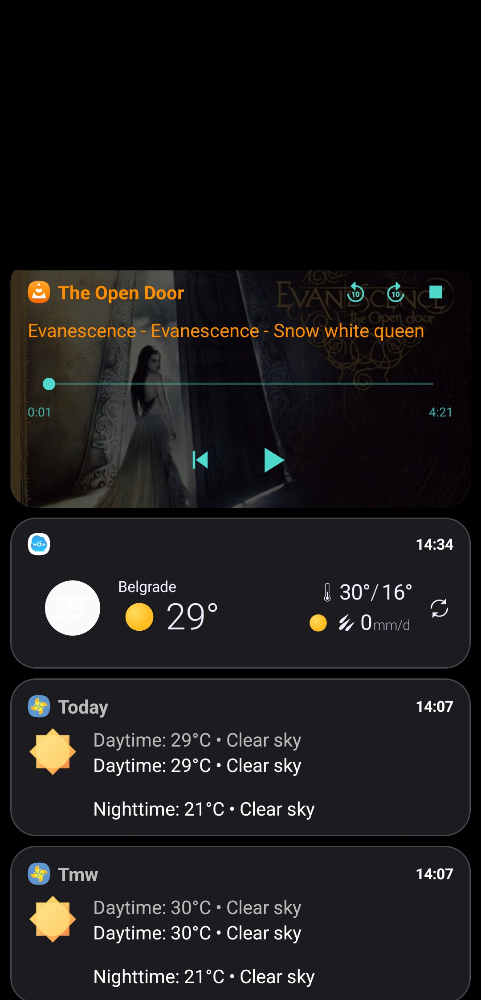

# Bottom notifications

### Reach your notifications with your thumb, not a stretch

**Bring your notifications to the bottom. Private, offline, endlessly custom.**

  

---

Bottom notifications puts a notification shade at the **bottom** of your screen, where your hand already is. Tap a small floating button and your notifications slide up from the bottom - easy to read, easy to reach, and easy to make your own.

---

## 💬 Feedback, bug reports & feature requests

This repository is the home for **reporting issues and requesting features** for Bottom notifications.

- 🐞 **Found a bug?** [Report a bug](../../issues/new?template=bug_report.yml) and tell us what happened, what you expected, and your device / Android version.
- 💡 **Have an idea?** [Request a feature](../../issues/new?template=feature_request.yml) - I read every suggestion.
- 👍 **Want something that's already been suggested?** Browse [bug reports](../../issues?q=is%3Aissue+label%3Abug) and [feature requests](../../issues?q=is%3Aissue+label%3Aenhancement) and add a 👍 or a comment so I know it matters to you.

Please search the [open issues](../../issues) first to avoid duplicates.

---

## ✨ What you can do

- **A notification manager, not just a shade** - write rules that watch for the notifications you describe, then act on them. See below.
- **Snooze and action buttons on every row** - snooze in one tap from a list of durations (including your own custom one), and an Actions button that lists what a notification really holds: a verification code, a link, a phone number, the message itself - each one ready to open, copy or share. Long-press a row for app-wide choices: pin, group, exclude, or make a rule for it.
- **A shade that fits you** - design the floating button (size, shape, corners, colours, border, position) and style every part of a notification: background, icon, name, title, text, time, and buttons.
- **Pick a browsing style** - a clean scrolling list or a playful "ferris wheel" that turns as you scroll.
- **Everyday helpers** - swipe to dismiss, tap to open, and reply to messages right from the shade.
- **Built-in media player** - play/pause, skip, seek, shuffle, repeat, and album art.
- **Smart filtering** - choose which apps show up, hide the rest, group a chatty app into one expandable row, and pin favourites to the top or bottom. Do Not Disturb aware.
- **Gestures & shortcuts** - give the button a tap and four swipe directions, each doing whatever you choose; group actions into "modes" and switch with a swipe.
- **Home screen widgets** - a full notification list widget (works on the lock screen too), slim icon-strip widgets, and a tiny count widget.
- **Open it your way** - from the home screen, lock screen, or an automation app like MacroDroid or Tasker.

---

## 🧠 The notification manager

A rule watches for the notifications you describe, then acts on them - no tapping required.

**What a rule can do**

- **Silence, snooze or dismiss** a notification as it arrives.
- **Hold it back and deliver it in a batch** - at times you choose, or once an hour.
- **Let the first one through and keep the rest quiet**, so a busy chat interrupts you once instead of thirty times.
- **Remind you later** about anything you did not deal with.
- **Alert differently for what matters** - your own sound, a choice of vibration patterns, a torch flash, a ringer change, or the notification read aloud.
- **Copy a verification code** to the clipboard the moment it arrives.
- **Press a notification's own buttons, send a reply, or open it** for you.

**What a rule can match on**

App, words (anywhere, as whole words, or as a pattern), category, importance, group chats, contacts, pictures, replies, text length, the time of day for each weekday, and what the phone is doing - screen, call, ringer, or Do Not Disturb. Conditions combine with and/or, nest in groups, and can be inverted.

**Living with them**

- **Ten ready-made templates** to start from, from copying verification codes to silencing message reactions.
- **Rules run top to bottom** and you drag them into order, so you decide what wins.
- **A quick-settings tile** hands back everything being held, the moment you want it.

---

## 📸 Screenshots

 

**Settings tours:**
[General](Screenshots/Settings%20-%20general.jpg) ·
[Notifications](Screenshots/Settings%20-%20notifications.jpg) ·
[Button](Screenshots/Settings%20-%20button.jpg) ·
[Shade](Screenshots/Settings%20-%20shade.jpg) ·
[Rules](Screenshots/Notification%20manager.jpg)

---

## 🔒 Your privacy comes first

- **No internet access at all.** Your notifications physically cannot leave your device.
- **No ads. No trackers. No analytics.**
- **No account, no sign-up, no email required.**

The only things the app needs are notification access (so it can show your notifications) and permission to display over other apps (so the button and shade can appear). A couple of extra permissions, including the optional Accessibility Service below, are completely optional and only power bonus features - you are always in control.

---

## 🔑 How this app uses the Accessibility Service

Bottom notifications includes an optional Accessibility Service. It is turned **OFF by default**, you are never required to enable it, and every other feature works fully without it. If you choose to turn it on, it powers three convenience features for the floating button:

1. **Per-app button behaviour** - it detects which app is in the foreground, so the button can change how it behaves (for example move aside or hide) only in the apps you choose.
2. **Keyboard-aware button** - it detects when the on-screen keyboard is visible and where it sits, so the button can move out of the way or hide while you type.
3. **Navigation gestures** - it performs Back, Home, and Recent-apps actions when you assign one of those to a button tap or swipe.

The service only checks which app is in front and whether the keyboard is showing. It does **NOT** read, log, record, collect, or transmit the content of your screen, your keystrokes, or any personal data. Because the app has no internet access at all, nothing it observes can ever leave your device. You can turn it off at any time in Android's Accessibility settings.

---

## 📌 A few things to know

- Works on **Android 10 and newer**.
- Some phones aggressively close background apps. If the button ever disappears, the in-app tips help keep it running.

---

Bottom notifications is for anyone who wants their notifications closer to hand, styled their way, and kept on their own device. Give it a try and make it yours.

