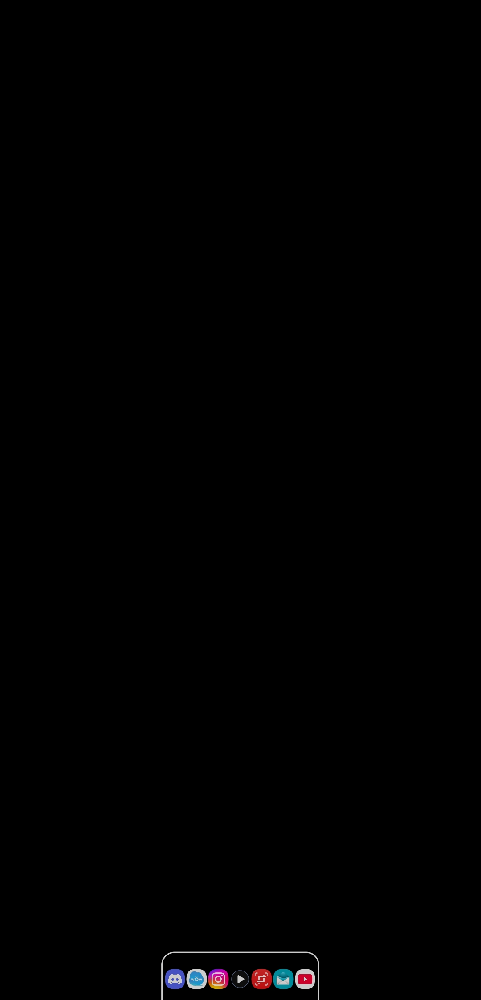
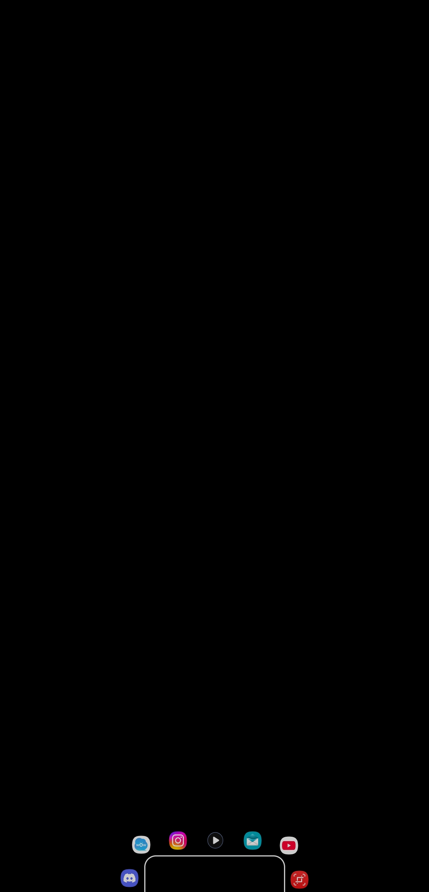
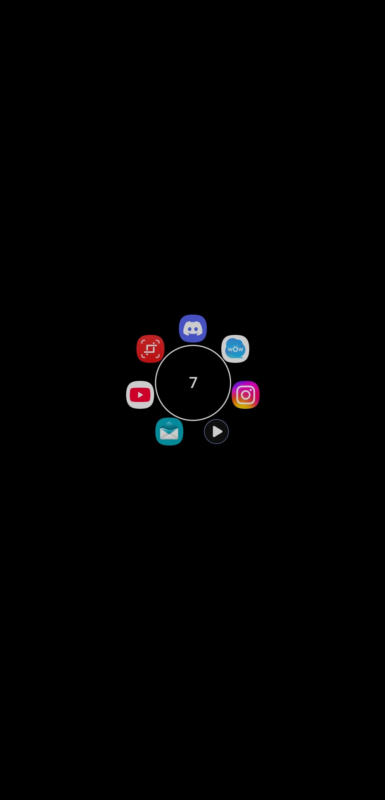
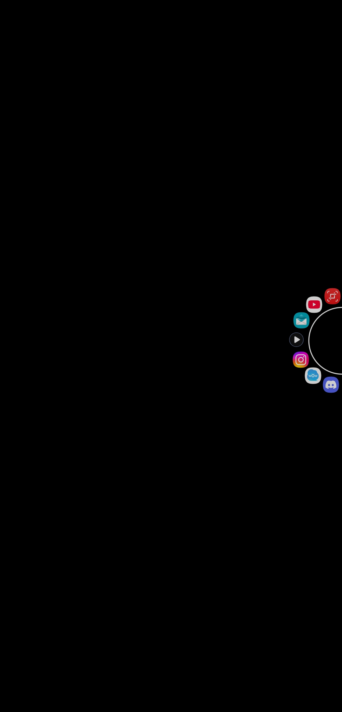

# Bottom notifications

### Reach your notifications with your thumb, not a stretch

**Bring your notifications to the bottom. Private, offline, endlessly custom.**

  

---

Bottom notifications puts a notification shade at the **bottom** of your screen, where your hand already is. Tap a small floating button and your notifications slide up from the bottom - easy to read, easy to reach, and easy to make your own.

---

## 💬 Feedback, bug reports & feature requests

This repository is the home for **reporting issues and requesting features** for Bottom notifications.

- 🐞 **Found a bug?** [Report a bug](../../issues/new?template=bug_report.yml) and tell us what happened, what you expected, and your device / Android version.
- 💡 **Have an idea?** [Request a feature](../../issues/new?template=feature_request.yml) - I read every suggestion.
- 👍 **Want something that's already been suggested?** Browse [bug reports](../../issues?q=is%3Aissue+label%3Abug) and [feature requests](../../issues?q=is%3Aissue+label%3Aenhancement) and add a 👍 or a comment so I know it matters to you.

Please search the [open issues](../../issues) first to avoid duplicates.

---

## ✨ What you can do

- **A shade that fits you** - design the floating button (size, shape, corners, colours, border, position) and style every part of a notification: background, icon, name, title, text, time, and buttons.
- **Pick a browsing style** - a clean scrolling list or a playful "ferris wheel" that turns as you scroll.
- **Everyday helpers** - swipe to dismiss, tap to open, and reply to messages right from the shade.
- **Built-in media player** - play/pause, skip, seek, shuffle, repeat, and album art.
- **Smart filtering** - choose which apps show up, hide the rest, and pin favourites to the top or bottom. Do Not Disturb aware.
- **Gestures & shortcuts** - give the button a tap and four swipe directions, each doing whatever you choose; group actions into "modes" and switch with a swipe.
- **Home screen widgets** - a full notification list widget (works on the lock screen too), slim icon-strip widgets, and a tiny count widget.
- **Open it your way** - from the home screen, lock screen, or an automation app like MacroDroid or Tasker.

---

## 📸 Screenshots

---

## 🔒 Your privacy comes first

- **No internet access at all.** Your notifications physically cannot leave your device.
- **No ads. No trackers. No analytics.**
- **No account, no sign-up, no email required.**

The only things the app needs are notification access (so it can show your notifications) and permission to display over other apps (so the button and shade can appear). A couple of extra permissions, including the optional Accessibility Service below, are completely optional and only power bonus features - you are always in control.

---

## 🔑 How this app uses the Accessibility Service

Bottom notifications includes an optional Accessibility Service. It is turned **OFF by default**, you are never required to enable it, and every other feature works fully without it. If you choose to turn it on, it powers three convenience features for the floating button:

1. **Per-app button behaviour** - it detects which app is in the foreground, so the button can change how it behaves (for example move aside or hide) only in the apps you choose.
2. **Keyboard-aware button** - it detects when the on-screen keyboard is visible and where it sits, so the button can move out of the way or hide while you type.
3. **Navigation gestures** - it performs Back, Home, and Recent-apps actions when you assign one of those to a button tap or swipe.

The service only checks which app is in front and whether the keyboard is showing. It does **NOT** read, log, record, collect, or transmit the content of your screen, your keystrokes, or any personal data. Because the app has no internet access at all, nothing it observes can ever leave your device. You can turn it off at any time in Android's Accessibility settings.

---

## 📌 A few things to know

- Works on **Android 10 and newer**.
- Some phones aggressively close background apps. If the button ever disappears, the in-app tips help keep it running.

---

Bottom notifications is for anyone who wants their notifications closer to hand, styled their way, and kept on their own device. Give it a try and make it yours.

