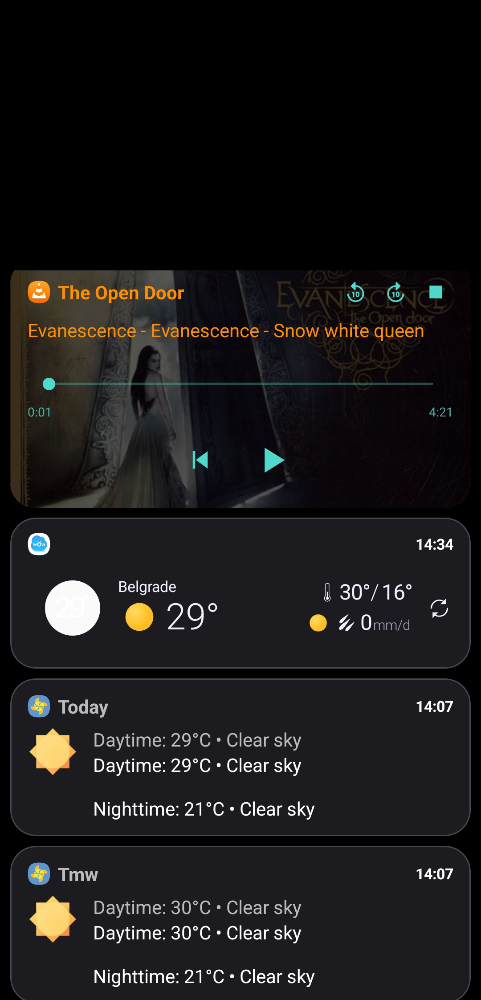

# Bottom notifications

### Reach your notifications with your thumb, not a stretch

**Bring your notifications to the bottom. Private, ad-free, endlessly custom.**

  

---

Bottom notifications puts a notification shade at the **bottom** of your screen, where your hand already is. Tap a small floating button, or swipe in from the edge of the screen, and your notifications slide up from the bottom - easy to read, easy to reach, and easy to make your own.

It is also a full **notification manager**: rules that watch for the notifications you describe and act on them for you, all on your device.

---

## 💬 Feedback, bug reports & feature requests

This repository is the home for **reporting issues and requesting features** for Bottom notifications.

- 🐞 **Found a bug?** [Report a bug](../../issues/new?template=bug_report.yml) and tell us what happened, what you expected, and your device / Android version.
- 💡 **Have an idea?** [Request a feature](../../issues/new?template=feature_request.yml) - I read every suggestion.
- 👍 **Want something that's already been suggested?** Browse [bug reports](../../issues?q=is%3Aissue+label%3Abug) and [feature requests](../../issues?q=is%3Aissue+label%3Aenhancement) and add a 👍 or a comment so I know it matters to you.

Please search the [open issues](../../issues) first to avoid duplicates.

---

## ✨ At a glance

- **A shade at the bottom** - your notifications slide up from where your thumb is, in a list or one of 20 browsing styles.
- **A notification manager** - rules that silence, hold, snooze, dismiss, pin, protect, remind, copy codes, reply or press buttons for you. [More below](#-the-notification-manager).
- **A floating button you design** - shape, size, colours, icons around it, animations, and where it goes when you type, watch a video or turn the phone.
- **Gestures everywhere** - a tap plus 16 swipes on the button, an Action wheel, and invisible Edge swipe strips on the sides of the screen.
- **Screen lighting** - the screen edge and the space around the button light up when a notification arrives.
- **Animals** - a pixel-art dog or cat roams along the bottom of your screen, 35 to choose from. [More below](#-animals).
- **Pin and protect** - keep a notification at the top or bottom of the shade, and stop the important ones from being swiped away or cleared.
- **Widgets and the lock screen** - a full notification list widget, slim icon strips, a count, and the shade on your lock screen.
- **Your look** - Material You, 75 ready-made themes, your own themes, icon packs and your own icon for any app.
- **Private** - no ads, no trackers, no analytics, no account. Your notifications never leave your device.

---

## 🔔 The shade

**Every notification row**

- Tap to open, swipe to dismiss, use the notification's own buttons, see its progress bar, and reply right from the shade - the keyboard opens by itself and the notification you're replying to stays visible above it.
- **Snooze** in one tap from a list of up to 8 durations you can edit, each one "for a while" or "until a time".
- **Actions** lists what a notification really holds - a verification code, a link, a phone number, the message itself - each ready to open, copy or share. Opening a number fills in the dialer; it never calls.
- **Long-press** a row for: pin this notification at the top or the bottom, protect it, pin or protect the whole app, group it, exclude it, make a rule for it, or jump to the app's info and notification settings.
- Small icons on the row show what is pinned or protected.

**Buttons at the bottom of the shade**

- Clear all and Settings, plus Release held, Do Not Disturb and Snooze all. Choose which ones show and their order.

**Browsing styles and animations**

- 20 browsing styles: List, Ferris wheel, Card stack, Spotlight, Coverflow, Wave, Fan, Origami, Flythrough, Swivel, Helix, Sway, Cascade, Tumble, Book, Swirl, Conveyor, Crescent, Lens (Android 12+) and Pinch.
- 35 open and close animations, or none at all.
- Wrap-around scrolling, push or pull to close, notifications shown in full, a starting position, remembering where you scrolled, and fine-tuning for swipe distance and speed.

**Size, place and style**

- Maximum width and height and the shade's position (left, centre or right), set separately for portrait and landscape.
- Space between notifications, the gap above the navigation bar, sort direction and a background overlay.
- Style every part of a notification: background and border (gradients too), header, body (hide pictures if you like), buttons, progress bar and the media player.

**Built-in media player**

- Play/pause, skip, seek, shuffle, repeat, album art (also as the row's background) and "Up next".

**Notification grouping**

- Fold a chatty app into a single row: its icon, a count, and a line per notification. Tap opens the app, one swipe clears the whole group. Turn it on per app, from the settings or by long-pressing a row of the app that's annoying you.

**What shows up**

- Choose which apps appear (include or exclude), pin apps to the top or the bottom, protect apps, and show only - or hide - notifications containing the words you choose.
- Per-app colour, a limit on how many lines a notification shows, and your own icon for the app.
- Hide permanent notifications and ones without a time, split up grouped notifications, and follow Do Not Disturb so quiet time stays quiet.

---

## 🔘 The floating button

**Its look**

- Size, shape, corner radius (each corner separately if you like), colours, border and position - plus a separate look and position for when it's snapped to the edge, and placing it partly off screen.
- The latest notification's icon, or a full-button icon, and an unread number styled your way.
- **Icon cluster** - the icons of your notifications around the button in a Line, Orbit, Half orbit or Arc, with size, distance, order, colour and "+N" options.
- **56 animated icons**, including a real battery level and a clock.
- **While music plays** - album art, or one of 8 animations: Record, Tape, CD, Equalizer, Pulse, Music notes, Wave or Scrolling title, most of them in a colour you pick.
- **Charging indicator** - a ring or progress ring with 5 animations: Sweep, Breathe, Orbiting dot, Fill and Liquid fill.
- **New-notification animation** - Pop, Wiggle, Glow flash or Hop.
- **Appear and hide** with any of the shade's 35 animations, travelling to and from the nearest screen edge. "Try it" plays it on the real button.

**Its behaviour**

- Snap to the screen edges with a fling.
- Decide what it does when the keyboard is open, in full screen apps, in landscape, when there are no notifications, and in the apps you pick: work as usual, hide, let taps through, move above the keyboard, snap or unsnap.
- Hide it while the shade is open.
- Hide it for a while, or until the next notification, with a gesture.
- Turn the button off entirely and open the shade another way (Edge swipe, a widget, the home screen or an automation app).

---

## 👆 Gestures, Action wheel and Edge swipe

**Button gestures**

- A tap plus 8 swipe directions, each with a short and a long swipe - 16 slots, each doing whatever you choose, with a visual configurator for the directions and distances.
- **Or an Action wheel** - swipe from the button and a wheel of actions opens in three rings around it: slide onto one and lift. The rings follow the button's shape, and slots that would fall off screen move to where you can reach them. Rename slots, drag to swap them, choose the icon size, spacing, names, vibration and background dim.
- A small animation (Nudge, Tilt, Pop or Glow) confirms the gesture.

**Edge swipe**

- Invisible strips on the left, the right or both screen edges, with a width and touch area you set on the real screen.
- Swipe in to open the shade, or give each of 5 directions (up, in and up, in, in and down, down - short and long) its own action, or open a half Action wheel from the edge.
- Both strips can share one set of actions (Mirror) or have their own.
- An optional visible hint (pill, rectangle or rounded rectangle) in your colour, and its own behaviour for the keyboard, full screen apps and the apps you pick.

**What a gesture can do**

- **Open app...** - any app, including work-profile apps.
- **Omnideck action...** - pick any action in [Omnideck](https://play.google.com/store/apps/details?id=com.omnideck.app) (an app's screen, a link, a website, a saved text, a web request, a Deck trigger and more), give it a name and an icon, and Omnideck runs it. Needs Omnideck 3.0.
- Open the shade, clear all notifications, release held notifications.
- Play/pause, previous, next, seek back or forward 10 seconds, stop, and favourite the current track.
- Volume up, volume down, toggle mute, torch.
- Back, Home, Recents, previous app, the assistant.
- Snap or unsnap the button, show or hide its icon cluster, hide it for a while or until the next notification.
- Open Bottom notifications' settings.

---

## 💡 Screen lighting

A new notification lights up the screen, with a screen-border effect and an effect around the button that play together.

- **10 border effects** - Basic, Multicolour, Glow, Echo, Neon, Lightning, Rise, Heartbeat, Drip and Converge.
- **20 effects around the button**, following its shape - Wave, Bubbles, Fireworks, Eclipse, Spotlight, Halo, Ripple, Sparkle, Pulse rings, Charge, Vortex, Sonar, Confetti, Swell, Fireflies, Raindrops, Wobble, Gyro, Drizzle and Fringe.
- In the notification's colour, your theme's or your own, with width, transparency and duration.
- Only notifications that alert you light it up - silent, ongoing and progress ones don't - and the light fades when its notification goes away.
- Rules can light up in their own style.

---

## 🐾 Animals

A little pixel-art pet lives at the bottom of your screen. It walks, sniffs, plays and naps, and taps go right through it.

- **16 dogs** - Labrador, Husky, Beagle, Corgi, Dalmatian, Pit Bull, Golden Retriever, German Shepherd, Dachshund, French Bulldog, Shiba Inu, Border Collie, Pomeranian, Rottweiler, Poodle and Pug.
- **19 cats** - House Cat, Orange Tabby, British Shorthair, Maine Coon, Ragdoll, Persian, Siamese, Russian Blue, Turkish Angora, Bombay, Bengal, Sphynx, Tuxedo, Calico, Tortoiseshell, Grey & White, Devon Rex, Savannah and Abyssinian.
- Each behaves like its animal: dogs trot, dig, bark and shake off; cats groom, loaf, knead, sharpen their claws, hunt with a pounce and always curl up to sleep. It never pops between poses.
- Size, energy (Calm, Normal or Playful) and whether it walks on the screen edge or above the navigation bar.
- Choose how long it stays and how long it is away, or keep it on screen always - or let it come only for notifications: it runs in and barks (a cat sits and meows), stays a while, then leaves.
- Hides in full screen apps, while you type, in landscape and in the apps you pick, and waits while Screen lighting plays over it. Nothing moves behind the lock screen.

---

## 🧠 The notification manager

A rule watches for the notifications you describe, then acts on them - no tapping required.
([See the Rules screen](#-screenshots).)

**What a rule can do**

- **Silence, snooze or dismiss** a notification as it arrives.
- **Hold it back and deliver it in a batch** - at times you choose, or every 15 minutes to 12 hours.
- **Let the first one through and keep the rest quiet**, so a busy chat interrupts you once instead of thirty times.
- **Remind you later** about anything you did not deal with.
- **Alert differently for what matters** - your own sound, 11 vibration patterns, a torch flash, Screen lighting in its own style, a ringer change, Do Not Disturb, or the notification read aloud.
- **Copy** a verification code, a phone number, or the text to the clipboard the moment it arrives.
- **Press a notification's own buttons, send a reply, or open it** for you.
- **Pin, unpin, protect or unprotect** it in the shade.
- Any action can wait a while before it runs.

**What a rule can match on**

- The app (any app, only some, or all but some).
- Words in the title, text, expanded text, subtext or sender - anywhere, as whole words, exactly, or as a pattern.
- Category, importance and text length.
- What kind of notification it is: ongoing, can't be swiped away, has a reply box or a picture, a chat or group chat message, from a contact, has a phone number or an emoji, a media player, a custom layout, from your work profile.
- The time of day, for each weekday.
- What the phone is doing - screen, call, ringer, microphone, or Do Not Disturb.
- Conditions combine with and/or, nest in groups, and can be inverted.

**Living with them**

- **Twenty ready-made templates** to start from, from copying verification codes to silencing message reactions.
- **Rules run top to bottom** and you drag them into order, so you decide what wins. A rule can stop the ones below it.
- Duplicate a rule, or pause them all at once.
- **A quick-settings tile**, a gesture and a shade button hand back everything being held, the moment you want it.

---

## 🧩 Widgets, lock screen and other ways in

- **Notification list widget** - the full shade on your home screen (and lock screen), with its own sort order and look.
- **Icon strip widgets** - a slim row or column of notification icons.
- **Count widget** - a tiny unread count.
- **Lock screen shade** - open the shade on the lock screen and reply from there, with its own look.
- **Open it your way** - long-press the app icon for "Show shade", add a separate shade icon to your launcher, or start it from an automation app like MacroDroid or Tasker.
- Optional Toggle shade and Toggle button controls in the app's own notification.

---

## 🎨 Themes, icons and backup

- **Material You** colours that follow your wallpaper (Android 12+).
- **75 ready-made themes**, your own themes, and a theme editor for the settings, button, shade and edge hint colours.
- **Icon packs** made for launchers like Nova and Lawnchair, used in the shade, on the button, in widgets and in app lists - and your own icon for any app, from a pack or a picture.
- Settings tabs at the top or the bottom.
- **Backup and restore** your settings, rules, themes and icons.
- What's new in the app, a built-in update check, and debug windows you can copy when reporting a problem.

---

## ⭐ Free and Pro

Bottom notifications is free to use. **Pro** is a one-time purchase - no subscription, no recurring charges - and unlocks themes and the theme editor, the lock screen shade, backup and restore, per-app colours, line limits and filters, full shade styling and browsing styles, button gestures, the Action wheel and Edge swipe actions, the icon cluster and button animations, button behaviour, grouping, unlimited rules, every Screen lighting effect, and the other 33 animals with every animal setting.

Free includes the bottom shade, the floating button's look and position, snooze and Actions, pinning a notification, the Clear all and Settings shade buttons, one rule, the Basic Screen lighting border, Edge swipe to open the shade, the Labrador and the House Cat, Material You, icon packs, and the icon strip and count widgets.

If Pro ever ends, your Pro settings are kept and come back when Pro does.

---

## 📸 Screenshots

 

**Settings tours:**
[General](Screenshots/Settings%20-%20general.jpg) ·
[Notifications](Screenshots/Settings%20-%20notifications.jpg) ·
[Button](Screenshots/Settings%20-%20button.jpg) ·
[Shade](Screenshots/Settings%20-%20shade.jpg) ·
[Edge swipe](Screenshots/Settings%20-%20edge%20swipe.jpg)

---

## 🔒 Your privacy comes first

- **Your notifications never leave your device.** The app never sends them anywhere.
- **No ads. No trackers. No analytics.**
- **No account, no sign-up, no email required.**

The only things the app needs are notification access (so it can show your notifications) and permission to display over other apps (so the button and shade can appear). Everything else is optional and only powers extra features - usage access (the button's per-app behaviour and Previous app), the Accessibility Service below, Do Not Disturb access, alarms (so rule reminders go off on time), contacts (only for the rule condition "from a contact") and ignoring battery optimisation. You are always in control.

---

## 🔑 How this app uses the Accessibility Service

Bottom notifications includes an optional Accessibility Service. It is turned **OFF by default**, you are never required to enable it, and every other feature works fully without it. If you choose to turn it on, it powers three things:

1. **Keyboard awareness** - it detects when the on-screen keyboard is visible and where it sits, so the floating button, the Edge swipe strips and the animal can move out of the way, let taps through or hide while you type.
2. **Navigation gestures** - it performs Back, Home, and Recent-apps actions when you assign one of those to a button or Edge swipe gesture.
3. **Rule actions** - Android only allows rules to press a notification's own buttons, open it, or reply while an accessibility service is on. The service itself taps nothing and reads nothing extra for this.

The service only checks whether the keyboard is showing and where. It does **NOT** read, log, record, collect, or transmit the content of your screen, your keystrokes, or any personal data, and nothing it observes ever leaves your device. You can turn it off at any time in Android's Accessibility settings.

---

## 🌍 Languages

Bottom notifications is available in **50 languages** and follows your phone's language automatically:

Arabic, Bengali, Bulgarian, Catalan, Chinese (Simplified), Croatian, Czech, Danish, Dutch, English, Estonian, Finnish, French, German, Greek, Gujarati, Hebrew, Hindi, Hungarian, Icelandic, Indonesian, Italian, Japanese, Kannada, Korean, Latvian, Lithuanian, Malayalam, Marathi, Norwegian, Persian, Polish, Portuguese (Brazil and Portugal), Punjabi, Romanian, Russian, Serbian (Cyrillic and Latin), Slovak, Slovenian, Spanish, Swahili, Swedish, Tamil, Telugu, Thai, Turkish, Ukrainian, Urdu, Vietnamese and Zulu.

If something reads wrong in your language, please [report it](../../issues/new?template=bug_report.yml).

---

## 📌 A few things to know

- Available in **50 languages** (see above).
- Works on **Android 10 and newer**, including foldables.
- Starts again by itself after a restart or an app update.
- Some phones aggressively close background apps. If the button ever disappears, the in-app tips help keep it running.

---

Bottom notifications is for anyone who wants their notifications closer to hand, styled their way, and kept on their own device. Give it a try and make it yours.

